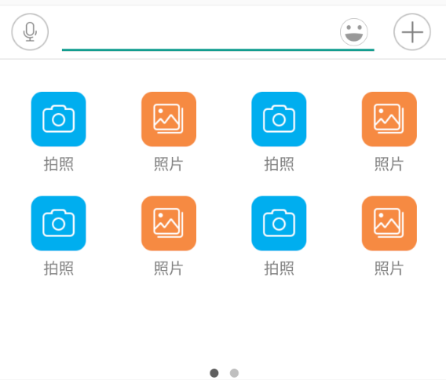
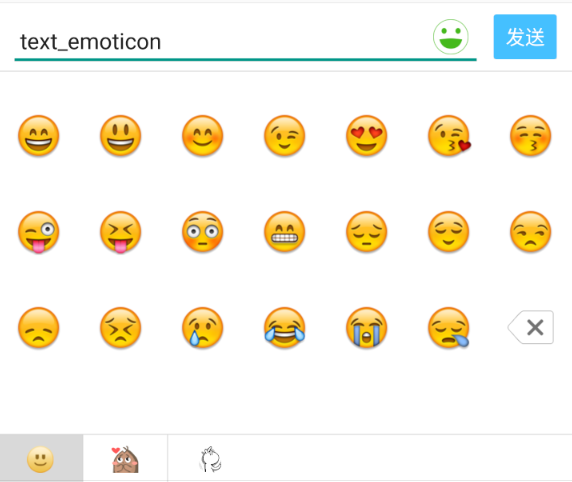
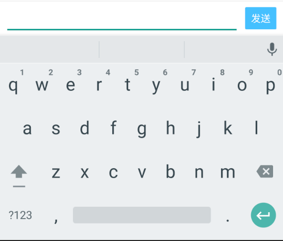

# ChatKeyboard   [](https://github.com/CPPAlien/ChatKeyboard) 

ChatKeyboard is a powerful and easy using keyboard lib for Android, includes emoticons selection, audio recording, multi media functions, etc.

- Let the lib handle the difficult keyboard actions, you just need listen the the results you want.
- Apply different styles of the keyboard.
- Custom your own icons in keyboard and the click action.
- More to find out by yourself.


### Demo
<div class='row'>
    
</div>

[Apk Download](http://cdn.flowergo.xyz/keyboard_new.apk)

### Import

Gradle:

dependencies {
    compile 'me.pengtao:ChatKeyboard:2.0.0'
}

If the jcenter is not ok, you can use jitpack way as below.

```
repositories{
    maven { url "https://jitpack.io" }
}
dependencies {
    compile 'com.github.CPPAlien:ChatKeyboard:1.0.1'
}
```
Latest Version：[](https://jitpack.io/#CPPAlien/ChatKeyboard)

### How to use

#### 1, ChatKeyboardLayout

make your layout get keyboard ability.

```
<cn.hadcn.keyboard.ChatKeyboardLayout
        android:id="@+id/kv_bar"
        android:layout_width="match_parent"
        android:layout_height="match_parent"
        android:layout_below="@id/toolbar"
        app:showRightIcon="true"
        app:keyboardStyle="chat_style"
        app:sendButtonBackground="@drawable/send_button_bg"
        app:sendButtonTextColor="#FFFFFF">
        ...your layout
</cn.hadcn.keyboard.ChatKeyboardLayout>
```
**Notice: You can only put one child view in ChatKeyboardLayout.**


#### 2, Style and Custom

There are three styles you can set.


|       chat_style        |       text_emoticon        |       text_only        |
| :---------------------: | :------------------------: | :--------------------: |
|  |  |  |


You can use `app:keyboardStyle` in xml to set or `setKeyboardStyle(@KeyboardStyle int style)` method to set, once you set, the keyboard style will change.

There are also some attributes you can custom the icons.

`app:sendButtonBackground`  custom send button background

`app:faceIcon`  custom keyboard bar face icon, you can use `state_selected` to distinguish emoticon layout pop or not state.

`app:showRightIcon` when you set the style as `chat_style`, the right place will just show send button in default, you should set this attribute as `true` to show the right multi media icon.

…  more you need find out yourself in demo.


#### 3, Emoticons and Stickers

```java
if (!ChatKeyboardLayout.isEmoticonInitSuccess(this)) {
	List<EmoticonEntity> entities = new ArrayList<>();
	entities.add(new EmoticonEntity("emoticons/xhs", EmoticonBase.Scheme.ASSETS));
	entities.add(new EmoticonEntity("emoticons/tusiji", EmoticonBase.Scheme.ASSETS));
	ChatKeyboardLayout.initEmoticonsDB(this, true, entities);
}
```
**Notice: Add the code above before the ChatKeyboardLayout used, better in onCreate of Application**


#### 4, Keyboard Listener

```java
public interface OnChatKeyBoardListener {
        /**
         * When send button clicked
         *
         * @param text content in input area
         */
        void onSendButtonClicked(String text);

        /**
         * When user input or delete text in input area
         *
         * @param text changing text
         */
        void onInputTextChanged(String text);

        /**
         * Recording button action {@link RecordingAction}
         *
         * @param action action
         */
        void onRecordingAction(RecordingAction action);

        /**
         * When sticker defined by developer clicked
         *
         * @param tag sticker tag
         * @param uri sticker location uri
         */
        void onUserDefEmoticonClicked(String tag, String uri);

        /**
         * when keyboard popped or back, get the pixels of the height include keyboard bar
         *
         * @param height pixel height
         */
        void onKeyboardHeightChanged(int height);
        
        /**
         * when left icon clicked, this will be called
         *
         * @param view view of clicked
         * @return true, won't execute default actions; false, execute default actions
         */
        boolean onLeftIconClicked(View view); 
        
        /**
         * when right icon clicked, this will be called
         *
         * @param view view of clicked
         * @return true, won't execute default actions; false, execute default actions
         */
        boolean onRightIconClicked(View view);
} 
```
You can use `SimpleOnChatKeyboardListener` instead of the interface above, so you can just implement these call back method you use.


### These you should know

1. Make sure the bottom of `ChatKeyboardLayout` align the screen bottom.
2. Make sure the height of `ChatKeyboardLayout` be at least 2/3 of you screen height.

### Other usage

Please refer to the demo code


## Thanks

Thanks for [xhsEmoticonsKeyboard](https://github.com/w446108264/XhsEmoticonsKeyboard) powered by w446108264 which is inspired me.


## License

```
Copyright (c) 2017 CPPAlien

Licensed under the Apache License, Version 2.0 (the "License");
you may not use this file except in compliance with the License.
You may obtain a copy of the License at

    http://www.apache.org/licenses/LICENSE-2.0

Unless required by applicable law or agreed to in writing, software
distributed under the License is distributed on an "AS IS" BASIS,
WITHOUT WARRANTIES OR CONDITIONS OF ANY KIND, either express or implied.
See the License for the specific language governing permissions and
limitations under the License.
```

